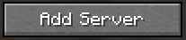

# Connecting to a server

<figure><figcaption></figcaption></figure>

## Joining with Minecraft Java Edition

To connect to a Java Edition Homerun Desktop Minecraft server, first you must download and install [**Minecraft Java Edition.**](https://www.minecraft.net/en-us/download)



### Copy the server address

Copy the server address to your clipboard, either through the Homerun Desktop app or by asking a friend. The address will appear similar to **"minecraft.gethomerun.app:12345"**.



### Launch Minecraft Java Edition

Launch Minecraft Java Edition through the Minecraft launcher.



### Open the Multiplayer menu

From the main Minecraft menu, click the "**Multiplayer"** button to open the Multiplayer menu.

<figure><figcaption></figcaption></figure>



### Click the Add Server button

In the Multiplayer menu, click the "**Add Server"** button to open the Server Info screen.

<figure><figcaption></figcaption></figure>



### Enter the server details

Enter a server name into the Server Name field and paste the server address into the Server Address field. Click "**Done"** when the information is accurate.



### Join the server

From the Multiplayer menu, select the new server and click the **"Join Server"** button.



## Joining with Minecraft Bedrock Edition

To connect to a Bedrock Edition Homerun Desktop Minecraft server, first make sure you have downloaded and installed [**Minecraft Bedrock Edition**](https://minecraft.net/en-us/store/minecraft-java-bedrock-edition-pc).



### Locate the server address and port

Locate the server address and port, either through the Homerun Desktop app or by asking a friend. The address will appear similar to **"Address: minecraft.gethomerun.app, Port: 12345"**.



### Launch Minecraft Bedrock Edition

Launch Minecraft Bedrock Edition through the Minecraft launcher.



### Open the Servers menu

From the main Minecraft menu, click the "**Play" button to open the play menu. From the play menu, click the "Servers" tab to open the servers menu.**

<figure><figcaption></figcaption></figure>



### Click the Add Server button

From the servers menu, click the "**+ Add Server**" button to open the Add A New Server screen.

<figure><figcaption></figcaption></figure>



### Enter the server details

Enter a server name into the Server Name field, enter the server address into the Server Address field, and enter the port into the Port field. Click "**Done"** when the information is accurate.



### Join the server

From the Multiplayer menu, select the new server and click the **"Join Server"** button.


