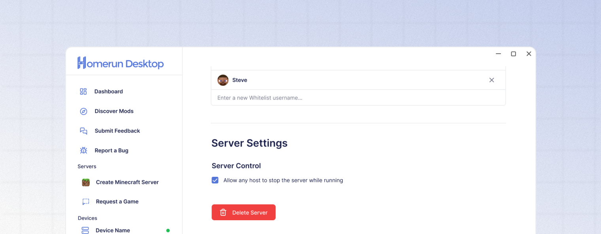

# Deleting a server

<figure><figcaption></figcaption></figure>

A Homerun Desktop server can be deleted by the server owner at any time. To delete a server, click the server's Settings button (⚙️) to open the Server Overview page. At the bottom of the Settings tab, click the **"Delete Server"** button.

Servers can not be recovered once they have been deleted.
