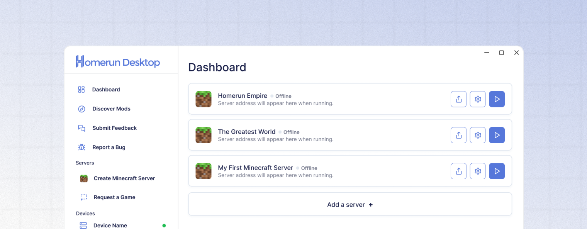

# Starting and stopping a server

<figure><figcaption></figcaption></figure>

## Power the server on

To start your server, press the Start Server (⏻) button for the world you wish to power on. The server will begin running on your current device.

## Power the server off

To shut your server down, press the Stop Server (⏻) button for the world you wish to power off. The server will save all current progress and begin shutting down.
