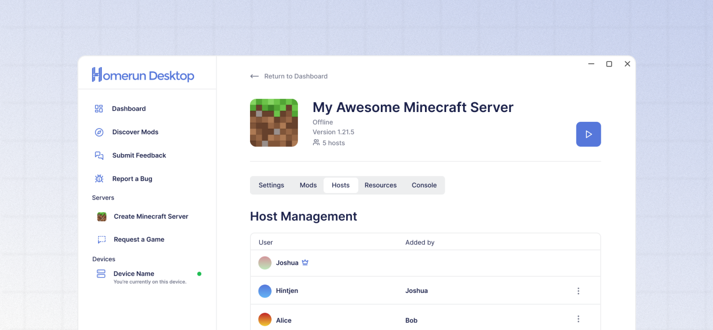

# Inviting and managing co-hosts

<figure><figcaption></figcaption></figure>

## What is a "co-host"?

The Homerun Desktop app offers the ability to invite friends to host and manage any server from their own device.

## Inviting a co-host



### Visit the Server Overview page

From the **Dashboard** page, click the Settings (⚙️) button for the server you wish to manage. This will open the **Server Overview** page.



### Click the Hosts tab

Underneath the server details section, click the **"Hosts"** tab.



### Enter the co-host's email

At the bottom of the Host Management table, click into the field that begins with "Invite a new host." Enter the email address of the co-host you wish to invite.



### Submit the invitation

Send the invitation by clicking the Submit button (✅) or by pressing the Enter key. The user will be notified by email and in the Homerun Desktop app.



## Removing a co-host



### Visit the Server Overview page

From the **Dashboard** page, click the Settings (⚙️) button for the server you wish to manage. This will open the **Server Overview** page.



### Click the Hosts tab

Underneath the server details section, click the **"Hosts"** tab.



### Open the three dot menu

Click the three dot icon ( ⋮ ) on the Host Management table entry for the co-host you wish to remove.



### Remove the co-host

With the menu open, click the "Remove Host" option.


