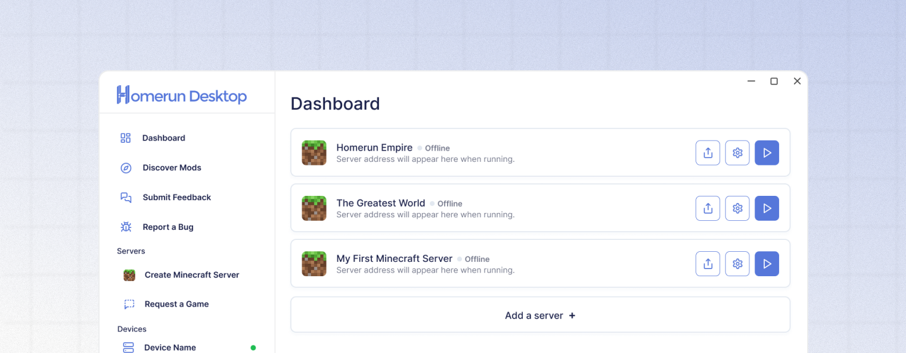

# Enabling and using voice chat

<figure><figcaption></figcaption></figure>

## Enabling the Simple Voice Chat plugin

The Simple Voice Chat plugin allows users with the client-side Simple Voice Chat mod installed to utilize proximity voice chat features. Homerun Desktop allows hosts to enable Simple Voice Chat with one click.



### Visit the Server Overview page

From the **Dashboard** page, click the Settings (⚙️) button for the server you wish to manage. This will open the **Server Overview** page.



### Click the Resources tab

Underneath the server details section, click the **"Resources"** tab.



### Select the checkbox

With your server offline, click the "Enable Simple Voice Chat" option and fill in the checkbox. After that, press **"**&#xD83D;� **Save Changes"** for the changes to take effect.



### Start your server

Press the Start Server button (▶️) to bring your server online. The Simple Voice Chat plugin will now be enabled, though **users must have the client-side mod installed** to utilize Simple Voice Chat features.


